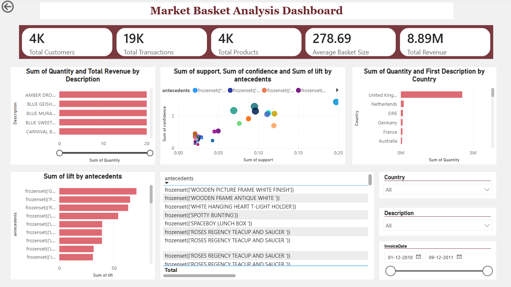

# 🛒 Market Basket Analysis Using Apriori Algorithm

## 📌 Project Overview

This project performs **Market Basket Analysis (MBA)** on retail transaction data to identify products that are frequently purchased together. Using the Apriori algorithm, it uncovers association rules that can help businesses improve cross-selling, product placement, and promotional strategies.

---

## 🎯 Objectives

- Clean and preprocess retail transaction data
- Perform exploratory data analysis (EDA)
- Generate frequent itemsets using the Apriori algorithm
- Create association rules using support, confidence, and lift
- Visualize insights
- Build an interactive Power BI dashboard

---

## 🛠️ Tools & Technologies

- Python
- JupyterLab
- Pandas
- NumPy
- Matplotlib
- mlxtend
- Power BI

---

## 📂 Dataset

**Dataset:** UCI Online Retail Dataset

It contains transactional data from a UK-based online retailer, including invoice numbers, product descriptions, quantities, prices, customers, and countries.

---

## 📊 Project Workflow

1. Data Collection
2. Data Cleaning
3. Exploratory Data Analysis
4. Basket Matrix Creation
5. Frequent Itemset Generation
6. Association Rule Mining
7. Business Insights
8. Power BI Dashboard

---

## 📈 Key Metrics

- Support
- Confidence
- Lift
- Leverage
- Conviction

---

## 📸 Dashboard Preview

## 📌 Business Insights

- Identified frequently purchased product combinations.
- Generated high-confidence association rules.
- Suggested product bundling opportunities.
- Recommended cross-selling strategies.
- Provided insights for store layout optimization.

---

## 📧 Author

**Swapnil**
